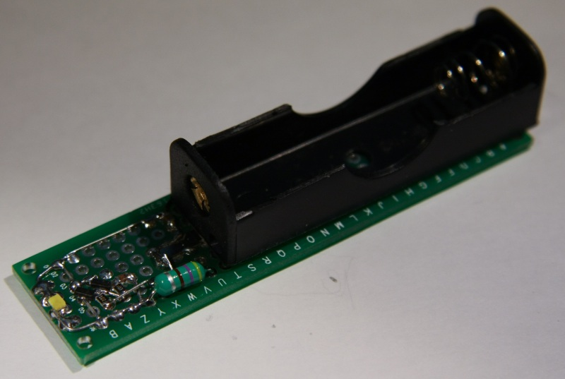
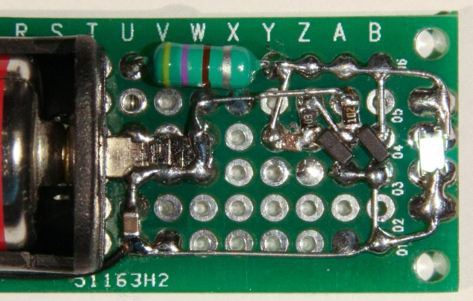

In januari 2013 I designed my own version of the joule thief. What is special is the use of a standard inductor instead of one with 3 connections that you need to wind yourself.

A joule thief is a circuit able to use the very last electron from a 1.5V battery. 'empty' AA cells contain enough energie to light a white LED for over a week.

The schematic made in LTSpice.

High enough voltage to light a white LED.

The pcb that is still in use in 2021.

